# Linux 简介

## 1. 什么是 Linux

Linux 是一个开源的操作系统，最初由 Linus Torvalds 在 1991 年创建。它现在由全球成千上万的开发者共同维护和改进。

[F**k you Nvidia (4K 60帧 SDR)_哔哩哔哩_bilibili](https://www.bilibili.com/video/BV1Hg411T7fT/?spm_id_from=333.337.search-card.all.click&vd_source=7309e1e11b1383dd33b5155a108b8ee5)

## 2. Linux 的优势

- 开放源代码：任何人都可以查看、修改和分发 Linux 的源代码。
- 免费：Linux 是免费的，用户无需支付任何费用即可使用。
- 安全性高：由于源代码公开，Linux 的安全性相对较高，可以及时发现和修复漏洞。
- 灵活性强：Linux 可以运行在各种硬件平台上，包括个人电脑、服务器、嵌入式设备等。

## 3. Linux 的基本概念

- 命令行界面（CLI）：Linux 的命令行界面是用户与系统交互的主要方式。用户可以通过输入命令来执行各种操作。

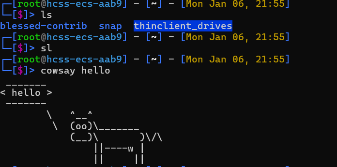


- 文件系统：Linux 的文件系统采用层次结构，所有的文件和目录都从根目录（/）开始。
- 用户和权限：Linux 系统有多个用户，每个用户有不同的权限。超级用户（root）拥有最高的权限，可以执行任何操作。


### 为什么选择Linux，特别是在工业领域控制领域和自动化领域

Linux操作系统在工业领域控制和自动化领域的应用越来越广泛，这背后有多方面的原因：

1. **开放性和可定制性**：
    - Linux的开源性质允许用户和开发者自由查看、修改和分发源代码。这使得Linux可以根据特定的工业需求进行定制，满足不同应用场景的特殊要求。
2. **稳定性与可靠性**：
    - Linux以其出色的稳定性和可靠性而闻名。在工业环境中，系统崩溃或故障可能导致严重的后果，因此操作系统必须高度稳定。Linux在长时间运行中表现出色，能够承受高强度的工作负载。
3. **安全性**：
    - Linux的安全性较高，部分原因在于其开放的源代码允许全球的开发者共同审查和改进代码，及时发现和修复安全漏洞。此外，Linux提供了强大的访问控制和安全机制，有助于保护工业控制系统免受未授权访问和恶意攻击。
4. **硬件兼容性**：
    - Linux支持广泛的硬件平台，从嵌入式设备到高性能服务器。这使得Linux能够适应工业领域中各种不同的硬件配置和需求。
5. **社区支持和生态系统**：
    - Linux拥有一个庞大且活跃的开发者社区，提供了丰富的资源、工具和库。这不仅有助于解决技术问题，还促进了创新和新技术的快速采用。
6. **成本效益**：
    - 由于Linux是免费的，使用Linux可以显著降低软件成本。此外，Linux的开源性质还意味着用户可以避免供应商锁定，有更多的选择和灵活性。
7. **实时性能**：
    - 对于需要实时响应的工业控制系统，Linux可以通过实时补丁（如PREEMPT_RT）来增强其实时性能，满足高精度控制的要求。

[工厂的心脏：Linux如何在工控领域战胜Windows而赢得大众青睐？-CSDN博客](https://blog.csdn.net/zls365365/article/details/140861911)

### 边缘控制领域Linux的选择的必然性

在边缘控制领域，Linux的选择具有必然性，原因如下：

1. **边缘计算的需求**：
    - 边缘计算强调在数据源附近进行数据处理，以减少延迟和带宽使用。Linux的灵活性和可定制性使其能够适应边缘设备的多样性和特定需求。
2. **资源效率**：
    - 边缘设备通常资源有限，Linux能够高效地利用有限的计算资源，提供必要的功能和服务，同时保持低功耗。
3. **安全性**：
    - 边缘设备往往直接连接到互联网，安全性至关重要。Linux的安全机制和社区支持有助于保护边缘设备免受网络威胁。
4. **可扩展性和集成性**：
    - Linux支持各种通信协议和接口，便于与不同的传感器、执行器和其他设备集成。此外，Linux的模块化设计允许轻松添加或移除功能，以适应不断变化的需求。
5. **实时能力**：
    - 对于需要实时控制的边缘应用，Linux可以通过实时补丁来提供必要的实时性能，确保控制指令能够及时执行。
6. **社区和生态系统**：
    - Linux的活跃社区和丰富的生态系统为边缘控制提供了大量的资源、工具和解决方案，加快了开发和部署的速度。
7. **标准化和互操作性**：
    - Linux在工业领域的广泛应用促进了标准化和互操作性，使得不同供应商的设备和系统能够更容易地协同工作。

[边缘计算：大势所趋，助力数字化转型](https://cloud.baidu.com/article/355369)

# 常用命令

## 4.1 文件和目录操作

- `ls`：列出目录内容。
- `cd`：切换目录。
- `pwd`：显示当前目录的路径。
- `mkdir`：创建目录。
- `rm`：删除文件或目录。
- `cp`：复制文件或目录。
- `mv`：移动或重命名文件或目录。

## 4.2 文件查看和编辑

- `cat`：显示文件内容。
- `less`：分页显示文件内容。
- `vim` 或 `nano`：文本编辑器，用于编辑文件。

## 4.3 系统信息

- `uname`：显示系统信息。
- `df`：显示磁盘空间使用情况。
- `free`：显示内存使用情况。
- `top` 或 `htop`：显示系统进程和资源使用情况。

## 4.4 网络

- `ifconfig` 或 `ip`：显示网络接口信息。
- `ping`：测试网络连接。
- `ssh`：远程登录到另一台计算机。
- `scp`：在计算机之间复制文件。

```bash
# 文件和目录操作
ls -l          # 列出目录内容，包括详细信息
cd /path/to/dir # 切换到指定目录
pwd            # 显示当前目录的完整路径
mkdir new_dir  # 创建一个名为 new_dir 的新目录
rm file.txt    # 删除名为 file.txt 的文件
rm -r dir      # 删除名为 dir 的目录及其内容
cp file.txt /path/to/dest # 复制文件到指定目录
mv file.txt /path/to/dest # 移动文件到指定目录或重命名文件

# 文件查看和编辑
cat file.txt   # 显示文件内容
less file.txt  # 分页显示文件内容
vim file.txt   # 使用 vim 文本编辑器编辑文件
nano file.txt  # 使用 nano 文本编辑器编辑文件

# 系统信息
uname -a       # 显示系统信息，包括内核版本和操作系统
df -h          # 显示磁盘空间使用情况，以人类可读的格式
free -m        # 显示内存使用情况，以兆字节为单位
top            # 显示系统进程和资源使用情况
htop           # 显示系统进程和资源使用情况（更直观）

# 网络
ifconfig       # 显示网络接口信息（旧命令）
ip addr show   # 显示网络接口信息（新命令）
ping google.com # 测试与 google.com 的网络连接
ssh user@host  # 远程登录到另一台计算机
scp file.txt user@host:/path/to/dest # 在计算机之间复制文件

# 安装软件
# Debian/Ubuntu
sudo apt update # 更新软件包列表
sudo apt install software-name # 安装软件

# Fedora
sudo dnf install software-name # 安装软件

# Arch Linux
sudo pacman -S software-name # 安装软件

```

# 安装软件

## 5.1 包管理器

不同的 Linux 发行版使用不同的包管理器：

- Debian/Ubuntu：使用 `apt` 或 `apt-get`。

高级软件包工具（也称为 APT）是管理 Debian 和其他 Linux 发行版（例如 Ubuntu 和 Linux Mint）软件包的默认方式。它自 1998 年问世以来，以其稳定的性能和易用性而闻名。


- Fedora：使用 `dnf` 或 `yum`。

DNF 是 Dandified YUM 的缩写，是 Fedora 和其他基于 RPM 的发行版的包管理器。它于 2013 年随 Fedora 18 一起推出，旨在解决 YUM 的一些限制，同时保持向后兼容性。

- Arch Linux：使用 `pacman`。（吃豆人）


使用 Pacman，您可以轻松地从官方存储库 [安装](https://cn.linux-console.net/?p=34229#)软件包，或者在 AUR 助手的帮助下从 AUR（Arch 用户存储库）构建您自己的软件包。

[apt、dnf 与 pacman：Linux 包管理器有何不同？](https://cn.linux-console.net/?p=34229)

## 5.2 安装软件命令示例

- Debian/Ubuntu：
    
    ```
    sudo apt update
    sudo apt install <name>
    ```
    
- Fedora：
    
    ```
    sudo dnf install <name>
    
    ```
    
- Arch Linux：
    
    ```
    sudo pacman -S <name>
    ```
    

# 常见发行版

## 6.1 常见 Linux 发行版

- Ubuntu：适合初学者，界面友好，社区活跃。

- Fedora：由 Red Hat 公司赞助，注重创新和新技术。

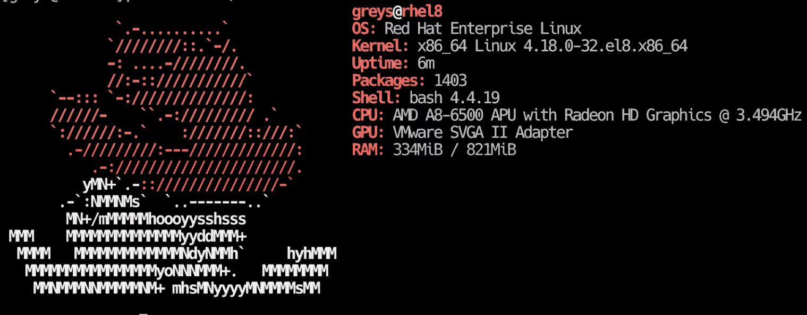

[红帽创始人：从裁缝铺里创业，340亿美元卖给IBM-CSDN博客](https://blog.csdn.net/weixin_34194702/article/details/86718358)

- CentOS：基于 Red Hat Enterprise Linux，稳定可靠，适合服务器使用。

- Debian：稳定性和安全性高，社区支持强大。


- Arch Linux：适合高级用户，提供最新的软件版本，手动配置。


# 学习资源

## 7.1 学习 Linux 的途径

- 官方文档：大多数Linux发行版都提供详细的官方文档，这是学习Linux的基础和权威来源。例如，Red Hat Enterprise Linux（RHEL）的文档被广泛认为是高质量的，涵盖从基础到高级主题。

- 在线教程：有许多在线教程和视频可以帮助学习 Linux。

- 社区论坛：Linux 社区非常活跃，可以在论坛上寻求帮助和交流经验（linux中国）。

[Linux初学者必知的5个学习网站_linux学习网站-CSDN博客](https://blog.csdn.net/weixin_49892805/article/details/134104853)

[分享|Linux 用户必备的 8 大网站](https://linux.cn/article-16366-1.html)

[分享|学习 Linux/*BSD/Unix 的 30 个最佳在线文档](https://linux.cn/article-10311-1.html)

## 云计算平台构建实操

[https://damodel.com/register?source=126A8B11](https://damodel.com/register?source=126A8B11)

# **Llama3.1-部署与使用**

LLaMA（Large Language Model Meta AI）是由 Meta（前 Facebook）发布的一款开源的大型语言模型系列，旨在为研究人员和开发者提供高效且灵活的自然语言处理工具。LLaMA 是一种基于 Transformer 架构的语言模型，专注于生成高质量文本、语言理解、文本补全等任务，同时在计算效率和资源需求方面进行了优化。

与其他大型语言模型（如 GPT 系列）相比，LLaMA 的特点包括：

1. **开源可用性**：LLaMA 提供了模型的代码和训练权重，研究者和开发者可以自由使用和进一步改进。
2. **多种规模模型**：LLaMA 提供了从数亿参数到数百亿参数的多个版本，便于开发者根据实际需求选择合适的规模。
3. **高效性**：在中小规模模型中，LLaMA 通过精细的架构设计和训练优化，实现了与更大规模模型相媲美的性能。
4. **广泛适用性**：LLaMA 适用于包括语言生成、翻译、问答、文本分类等多种自然语言处理任务。

LLaMA 的目标是降低大型语言模型的使用门槛，促进人工智能领域的开放研究和技术创新，同时推动自然语言处理技术的广泛应用。

大模型（LLM）狭义上指基于深度学习算法进行训练的自然语言处理（NLP）模型，主要应用于自然语言理解和生成等领域，广义上还包括机器视觉（CV）大模型、多模态大模型和科学计算大模型等。

百模大战正值火热，开源 LLM 层出不穷。如今国内外已经涌现了众多优秀开源 LLM，国外如 LLaMA、Alpaca，国内如 ChatGLM、BaiChuan、InternLM（书生·浦语）等。开源 LLM 支持用户本地部署、私域微调，每一个人都可以在开源 LLM 的基础上打造专属于自己的独特大模型。

丹摩智算平台（DAMODEL）是一款专为人工智能（AI）开发者设计的智能计算云服务，提供丰富的算力资源和基础设施，助力AI应用的开发、训练和部署。

[Damodel](https://doc.damodel.com/profile/about-damodel.html?utm_source=chatgpt.com)

**主要特点：**

- **用户友好**：平台配备124GB大内存和100GB系统盘，支持一键部署，三秒启动，简化AI开发流程。
    
    [Damodel](https://doc.damodel.com/profile/about-damodel.html?utm_source=chatgpt.com)
    
- **丰富资源**：从入门级到专业级GPU全面覆盖，满足不同层次开发者的需求。
    
    [Damodel](https://doc.damodel.com/profile/about-damodel.html?utm_source=chatgpt.com)
    
- **高性能**：自建IDC机房，采用全新GPU，确保顶级计算性能和专属服务。
    
    [Damodel](https://doc.damodel.com/profile/about-damodel.html?utm_source=chatgpt.com)
    
- **高性价比**：提供超低价格的优质算力服务，注册即送优惠券，并定期推出社区优惠活动。
    
    [Damodel](https://doc.damodel.com/profile/about-damodel.html?utm_source=chatgpt.com)
    

**使用场景：**

丹摩智算平台适用于AI模型的开发、训练和部署，支持从数据处理到模型训练的全流程操作。 平台兼容多种深度学习框架，如TensorFlow、PyTorch等，满足自然语言处理、计算机视觉等多种AI应用需求。

[Tencent Cloud](https://cloud.tencent.com/developer/article/2468900?utm_source=chatgpt.com)

**用户体验：**

用户反馈显示，丹摩智算平台在模型训练速度、稳定性和资源利用率方面表现出色。 例如，使用NVIDIA A100 GPU训练一个epoch耗时约35秒，速度优异。

[Tencent Cloud](https://cloud.tencent.com/developer/article/2468900?utm_source=chatgpt.com)

# **Llama3.1**

2024 年 7 月 23 日 Meta宣布推出迄今为止最强大的开源模型——Llama 3.1 405B，同时发布了全新升级的 Llama 3.1 70B 和 8B 模型。

Llama 3.1 405B支持上下文长度为128K Tokens，在基于15万亿个Tokens、超1.6万个H100 GPU上进行训练，这也是Meta有史以来第一个以这种规模进行训练的Llama模型。

Llama 3.1 与其他模型对比：


由于资源限制，我们此次选择部署 Llama3.1 的 8B 版本，**该版本至少需要GPU显存16G**。

本次测试环境：

> ubuntu 22.04 python 3.12 cuda 12.1 pytorch 2.4.0
> 

# **部署流程**

### **创建实例**

进入[**控制台-GPU云实例**](https://www.damodel.com/console/instance)，点击创建实例：


进入创建页面后，首先在实例配置中选择付费类型，一般短期需求可以选择按量付费或者包日，长期需求可以选择包月套餐；

其次选择GPU数量和需求的GPU型号，首次创建实例推荐选择：

按量付费--GPU数量1--NVIDIA-GeForc-RTX-4090，该配置为60GB内存，24GB的显存（本次测试的LLaMA3.1 8B 版本至少需要GPU显存16G）

接下来配置数据硬盘的大小，每个实例默认附带了50GB的数据硬盘，首次创建可以就选择默认大小50GB

**需关注**

如果您通过官方预制方式下载模型，建议扩容至60GB


继续选择安装的镜像，平台提供了一些基础镜像供快速启动，镜像中安装了对应的基础环境和框架，可通过勾选来筛选框架，这里筛选PyTorch，选择PyTorch 2.4.0。


为保证安全登录，创建密钥对，输入自定义的名称，然后选择自动创建并将创建好的私钥保存的自己电脑中并将后缀改为.pem，以便后续本地连接使用。


创建好密钥对后，选择刚刚创建好的密钥对，并点击立即创建，等待一段时间后即可启动成功！


### **登录实例**

等待实例创建成功，在 GPU云实例 中查看实例信息：


有多种方法登录：

### **JupyterLab**

平台提供了在线访问实例的 JupyterLab 入口，可以直接登录实例：


JupyterLab 界面：


登录后一般会在 /root/workspace 目录下，服务器各个路径具体意义如下：

1. `/`：系统盘，替换镜像，重置系统时系统盘数据都会重置。
2. `/root/workspace`：数据盘，支持扩容，保存镜像时此处数据不会重置。
3. `/root/shared-storage`：共享文件存储，可跨实例存储。

### **SSH登录**

SSH只是登录方式，工具可以是系统自带终端、Xshell、MobaXterm等。

SSH登录一般需要以下 4 个信息：

- 用户名：root
- 远程主机域名或IP（这里使用host域名）：实例页面获取
- 端口号：实例页面获取
- 登录密码或密钥（这里使用密钥）：前面创建实例时保存到本地的密钥

在实例页面获取主机host和端口号：


复制结果类似如下：

**bash**

```
ssh -p 31729 root@gpu-s277r6fyqd.ssh.damodel.com
```

1

其中，`gpu-s277r6fyqd.ssh.damodel.com` 即主机host，`31729` 为端口号。

终端登录方式详见[**SSH登录与密钥对**](https://doc.damodel.com/gpu/ssh.html)。

### **部署LLama3.1**

我们使用 `conda` 管理环境，DAMODEL示例已经默认安装了 `conda 24.5.0` ，直接创建环境即可：

**bash**

```
conda create -n llama3 python=3.12
```

1

环境创建好后，使用如下命令切换到新创建的环境：

**bash**

```
conda activate llama3
```

1

继续安装部署LLama3.1需要的依赖：

**bash**

```bash
pip install langchain==0.1.15
pip install streamlit==1.36.0
pip install transformers==4.44.0
pip install accelerate==0.32.1
```

1234

安装好后，下载 `Llama-3.1-8B` 模型，平台已预制`Llama-3.1-8B-Instruct`模型，执行以下命令即可内网高速下载：

**bash**

```bash
wget http://file.s3/damodel-openfile/Llama3/Llama-3.1-8B-Instruct.tar
```

1

下载完成后解压缩`/Llama-3.1-8B-Instruct.tar`

**bash**

```bash
tar -xf Llama-3.1-8B-Instruct.tar
```

1

# **使用教程**

模型下载好后，准备加载模型及启动Web服务等工作，新建 `llamaBot.py` 文件并在其中输入以下内容：

**python**

```python
from transformers import AutoTokenizer, AutoModelForCausalLM
import torch
import streamlit as st

# 创建一个标题和一个副标题
st.title("💬 LLaMA3.1 Chatbot")
st.caption("🚀 A streamlit chatbot powered by Self-LLM")

# 定义模型路径
mode_name_or_path = '/root/workspace/Llama-3.1-8B-Instruct'

# 定义一个函数，用于获取模型和tokenizer

@st.cache_resource
def get_model():
    # 从预训练的模型中获取tokenizer
    tokenizer = AutoTokenizer.from_pretrained(mode_name_or_path, trust_remote_code=True)
    tokenizer.pad_token = tokenizer.eos_token
    # 从预训练的模型中获取模型，并设置模型参数
    model = AutoModelForCausalLM.from_pretrained(mode_name_or_path, torch_dtype=torch.bfloat16).cuda()
  
    return tokenizer, model

# 加载LLaMA3的model和tokenizer
tokenizer, model = get_model()

# 如果session_state中没有"messages"，则创建一个包含默认消息的列表
if "messages" not in st.session_state:
    st.session_state["messages"] = []

# 遍历session_state中的所有消息，并显示在聊天界面上
for msg in st.session_state.messages:
    st.chat_message(msg["role"]).write(msg["content"])

# 如果用户在聊天输入框中输入了内容，则执行以下操作
if prompt := st.chat_input():
    
    # 在聊天界面上显示用户的输入
    st.chat_message("user").write(prompt)
    
    # 将用户输入添加到session_state中的messages列表中
    st.session_state.messages.append({"role": "user", "content": prompt})

    # 将对话输入模型，获得返回
    input_ids = tokenizer.apply_chat_template(st.session_state["messages"],tokenize=False,add_generation_prompt=True)
    model_inputs = tokenizer([input_ids], return_tensors="pt").to('cuda')
    generated_ids = model.generate(model_inputs.input_ids,max_new_tokens=512)
    generated_ids = [
        output_ids[len(input_ids):] for input_ids, output_ids in zip(model_inputs.input_ids, generated_ids)
    ]
    response = tokenizer.batch_decode(generated_ids, skip_special_tokens=True)[0]

    # 将模型的输出添加到session_state中的messages列表中
    st.session_state.messages.append({"role": "assistant", "content": response})
    # 在聊天界面上显示模型的输出
    st.chat_message("assistant").write(response)
    print(st.session_state)
```

在终端中运行以下命令，启动 streamlit 服务，`server.port` 可以更换端口：

```bash
streamlit run llamaBot.py --server.address 0.0.0.0 --server.port 1024
```

**需关注**

需注意服务地址务必指定位0.0.0.0，否则无法通过浏览器访问

接下来我们需要通过丹摩平台提供的端口映射能力，把内网端口映射到公网；

进入[**GPU 云实例页面**](https://www.damodel.com/console/instance)，点击操作-更多-访问控制：


点击添加端口，添加streamlit服务对应端口：


添加成功后，通过访问链接即即可打开LLaMA3.1 Chatbot交互界面，并与其对话：


## 使用vmware构建Linux虚拟机

# 简介

VMware是一家提供云计算和虚拟化解决方案的全球性公司，成立于1998年，总部位于美国加州帕洛阿尔托。VMware的产品和服务主要帮助企业构建、管理和优化其IT基础设施，无论是在本地、云端还是混合云环境中。

1. **虚拟化技术**：VMware的核心技术是虚拟化，它允许在一台物理服务器上运行多个独立的操作系统实例，这些实例被称为虚拟机（VM）。通过虚拟化，可以提高资源利用率，降低硬件成本，简化IT管理。
2. **服务器虚拟化**：VMware vSphere是VMware的服务器虚拟化平台，提供高级功能，如高可用性、故障转移、分布式资源调度等。
3. **桌面虚拟化**：VMware Horizon是桌面虚拟化解决方案，允许用户通过瘦客户端或移动设备远程访问其桌面环境和应用程序。
4. **云管理**：VMware Cloud Foundation和VMware vRealize Suite等产品提供多云管理能力，帮助企业在不同的云环境中实现统一的管理和自动化。
5. **网络虚拟化**：VMware NSX提供网络虚拟化功能，允许企业构建灵活、可编程的网络架构，以支持其虚拟化环境和云基础设施。
6. **存储虚拟化**：VMware vSAN是一种存储虚拟化解决方案，它将直接连接的存储设备聚合到虚拟化环境中，提供高性能和可扩展的存储服务。
7. **云服务**：VMware还提供云服务，如VMware Cloud on AWS，它允许客户在亚马逊云服务（AWS）上运行VMware的软件定义数据中心（SDDC）。

[VMware虚拟机安装Linux教程1：创建和配置虚拟机及基本操作环境（超详细）_vmware创建linux虚拟机步骤-CSDN博客](https://blog.csdn.net/m0_64006904/article/details/139627259?ops_request_misc=%257B%2522request%255Fid%2522%253A%25228f89fddd767c3937a5d37190065a662c%2522%252C%2522scm%2522%253A%252220140713.130102334..%2522%257D&request_id=8f89fddd767c3937a5d37190065a662c&biz_id=0&utm_medium=distribute.pc_search_result.none-task-blog-2~all~top_click~default-1-139627259-null-null.142^v101^control&utm_term=%E5%A6%82%E4%BD%95%E5%9C%A8vmware%E4%B8%AD%E4%BD%BF%E7%94%A8linux&spm=1018.2226.3001.4187)

[VMware虚拟机安装Ubuntu与配置Ubuntu（超详细教程）_vm安装ubuntu-CSDN博客](https://blog.csdn.net/weixin_55944949/article/details/130255886?ops_request_misc=&request_id=&biz_id=102&utm_term=vmware%E8%99%9A%E6%8B%9F%E6%9C%BA%E5%AE%89%E8%A3%85ubuntu&utm_medium=distribute.pc_search_result.none-task-blog-2~all~sobaiduweb~default-1-130255886.142^v101^control&spm=1018.2226.3001.4187)

VM虚拟机安装

[https://www.vmware.com/](https://www.vmware.com/products/desktop-hypervisor/workstation-and-fusion)


点击VMware Workstation选择需要版本的最新版本号，之后全部以默认进行安装即可

下载Ubuntu磁盘镜像

[https://ubuntu.com/download/desktop](https://ubuntu.com/download/desktop)


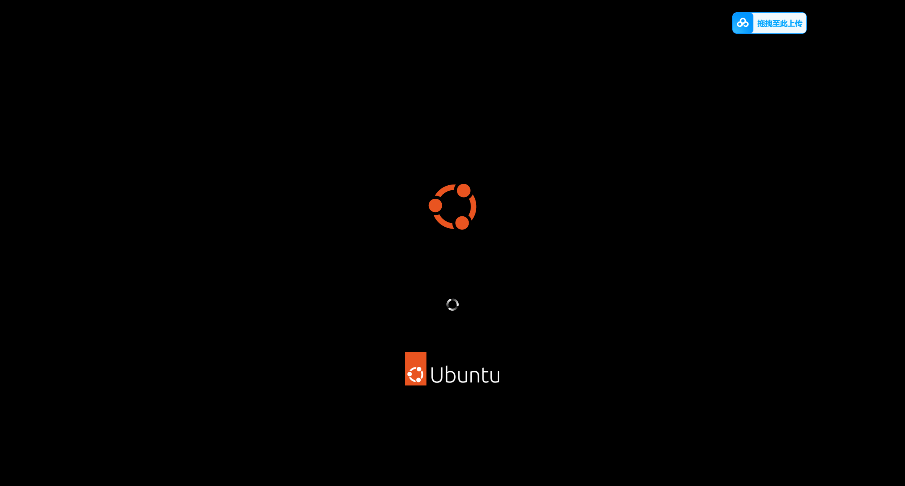

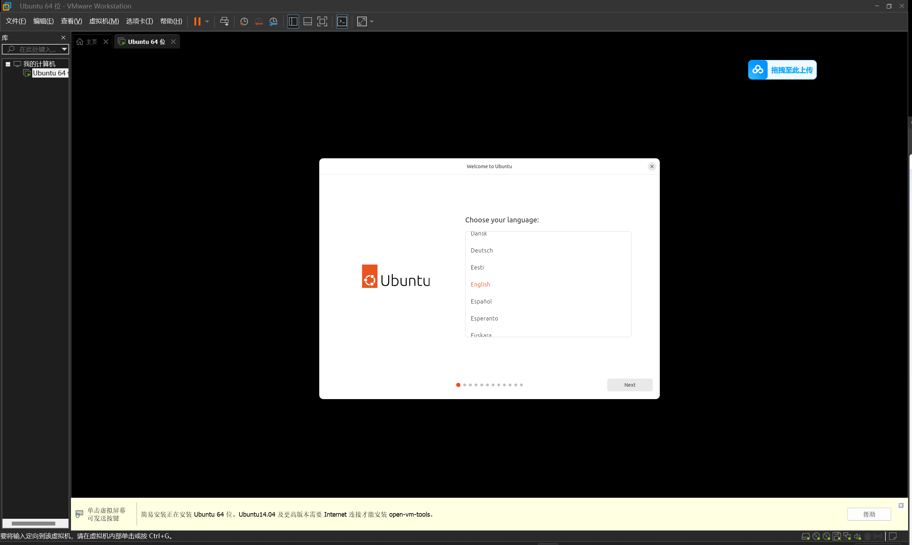

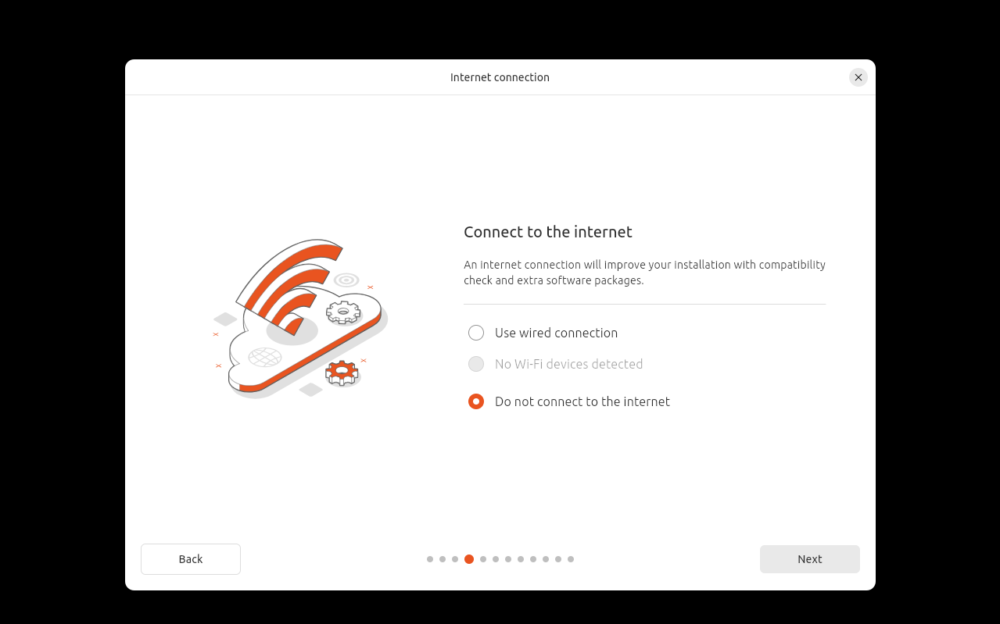

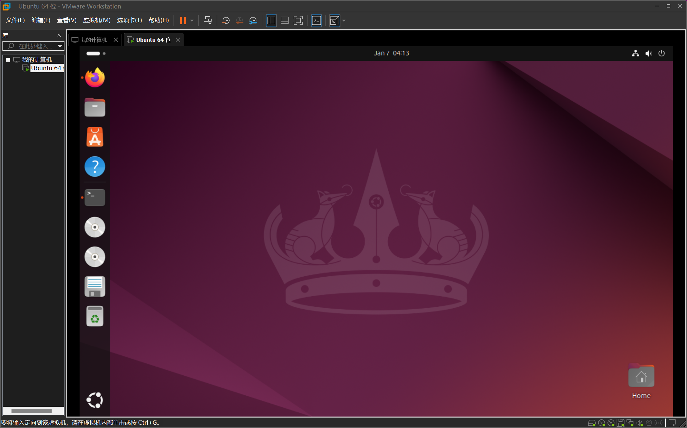

随着指引一步一步进行安装和配置，没有给出的图片只需要默认选择下一步即可

，最后的效果是出现完整的Ubuntu界面。

在虚拟机中进行hollywood脚本的测试

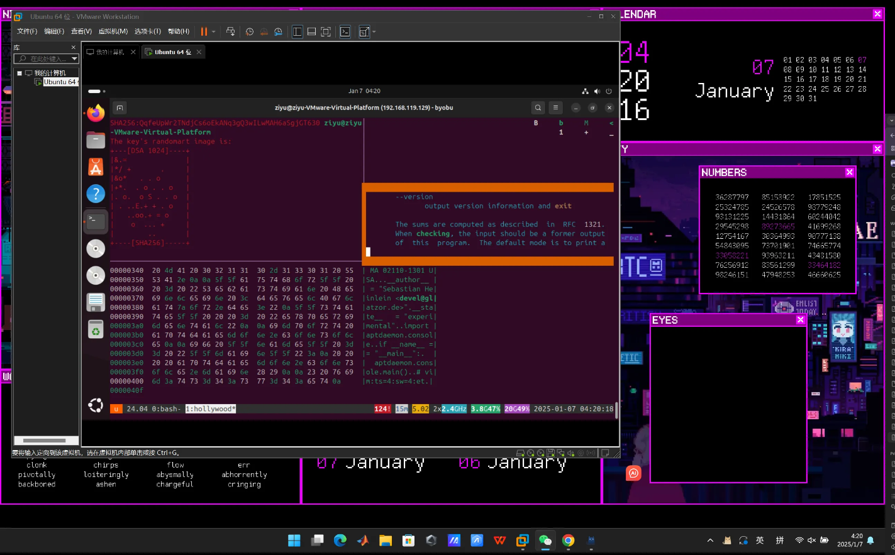

说明基本配置已经实现。

## 几个有趣且实用的linux脚本/指令/工具

oh-my-zsh

[https://ohmyz.sh/](https://ohmyz.sh/)

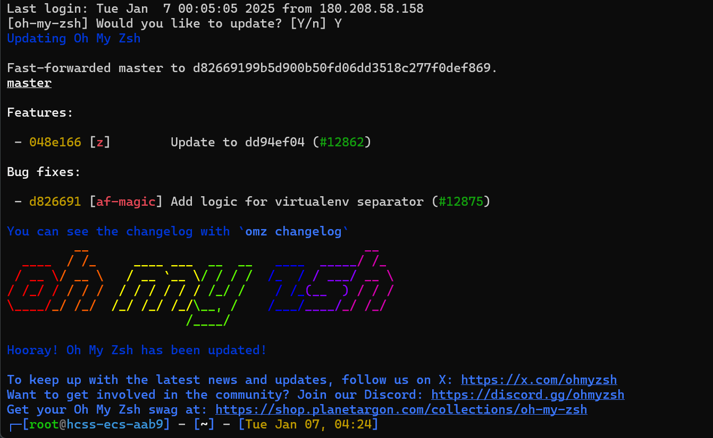

提供了一个美化命令行的工具（个人用体验感还是比较不错的，不足是可能太过庞大而消耗不必要的性能）

```bash
# 更新软件源
sudo apt update && sudo apt upgrade -y
# 安装 zsh git curl
sudo apt install zsh git curl -y
```

### 安装 oh-my-zsh

官网：[http://ohmyz.sh/](http://ohmyz.sh/)。 安装方式任选一个即可。

| Method | Command |
| --- | --- |
| **curl** | `sh -c "$(curl -fsSL https://install.ohmyz.sh/)"` |
| **wget** | `sh -c "$(wget -O- https://install.ohmyz.sh/)"` |
| **fetch** | `sh -c "$(fetch -o - https://install.ohmyz.sh/)"` |
| 国内curl[镜像](https://gitee.com/pocmon/ohmyzsh) | `sh -c "$(curl -fsSL https://gitee.com/pocmon/ohmyzsh/raw/master/tools/install.sh)"` |
| 国内wget[镜像](https://gitee.com/pocmon/ohmyzsh) | `sh -c "$(wget -O- https://gitee.com/pocmon/ohmyzsh/raw/master/tools/install.sh)"` |

注意：同意使用 Oh-my-zsh 的配置模板覆盖已有的 `.zshrc`。

vim

vim分为三种模式：命令模式，输入模式，底线命令模式
以编辑文件为例：

打开文件：vim 文件名
编辑文件：输入i,o,a 任一个字符进入输入模式（此时就可以对文件进行编辑）
ENTER,回车键，换行
BACK SPACE，退格键，删除光标前一个字符
DEL，删除键，删除光标后一个字符
方向键，在文本中移动光标
HOME/END，移动光标到行首/行尾
Page Up/Page Down，上/下翻页
Insert，切换光标为输入/替换模式，光标将变成竖线/下换线
ESC，退出输入模式，切换到命令模式
编辑文成，按ESC退出输入模式，回到一般模式
保存编辑并退出：输入“：wq”（别漏掉前面的：）


### **命令模式**

**用户刚刚启动 vi/vim，便进入了命令模式。**

此状态下敲击键盘动作会被 Vim 识别为命令，而非输入字符，比如我们此时按下 **i**，并不会输入一个字符，**i** 被当作了一个命令。

以下是普通模式常用的几个命令：

- **i** -- 切换到输入模式，在光标当前位置开始输入文本。
- **x** -- 删除当前光标所在处的字符。
- **:** -- 切换到底线命令模式，以在最底一行输入命令。
- **a** -- 进入插入模式，在光标下一个位置开始输入文本。
- **o**：在当前行的下方插入一个新行，并进入插入模式。
- **O** -- 在当前行的上方插入一个新行，并进入插入模式。
- **dd** -- 剪切当前行。
- **yy** -- 复制当前行。
- **p**（小写） -- 粘贴剪贴板内容到光标下方。
- **P**（大写）-- 粘贴剪贴板内容到光标上方。
- **u** -- 撤销上一次操作。
- **Ctrl + r** -- 重做上一次撤销的操作。
- **:w** -- 保存文件。
- **:q** -- 退出 Vim 编辑器。
- **:q!** -- 强制退出Vim 编辑器，不保存修改。

若想要编辑文本，只需要启动 Vim，进入了命令模式，按下 **i** 切换到输入模式即可。

命令模式只有一些最基本的命令，因此仍要依靠**底线命令行模式**输入更多命令。

### **输入模式**

在命令模式下按下 **i** 就进入了输入模式，使用 **Esc** 键可以返回到普通模式。

在输入模式中，可以使用以下按键：

- **字符按键以及Shift组合**，输入字符
- **ENTER**，回车键，换行
- **BACK SPACE**，退格键，删除光标前一个字符
- **DEL**，删除键，删除光标后一个字符
- **方向键**，在文本中移动光标
- **HOME**/**END**，移动光标到行首/行尾
- **Page Up**/**Page Down**，上/下翻页
- **Insert**，切换光标为输入/替换模式，光标将变成竖线/下划线
- **ESC**，退出输入模式，切换到命令模式

### **底线命令模式**

在命令模式下按下 **:**（英文冒号）就进入了底线命令模式。

底线命令模式可以输入单个或多个字符的命令，可用的命令非常多。

在底线命令模式中，基本的命令有（已经省略了冒号）：

- `:w`：保存文件。
- `:q`：退出 Vim 编辑器。
- `:wq`：保存文件并退出 Vim 编辑器。
- `:q!`：强制退出Vim编辑器，不保存修改。

按 **ESC** 键可随时退出底线命令模式。

btop

`sudo apt install btop`

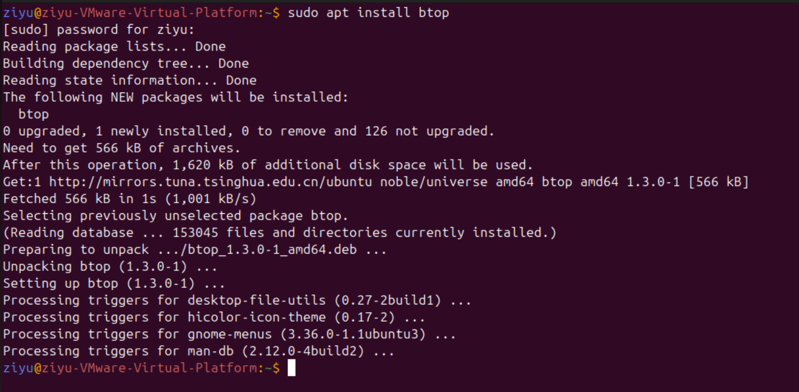

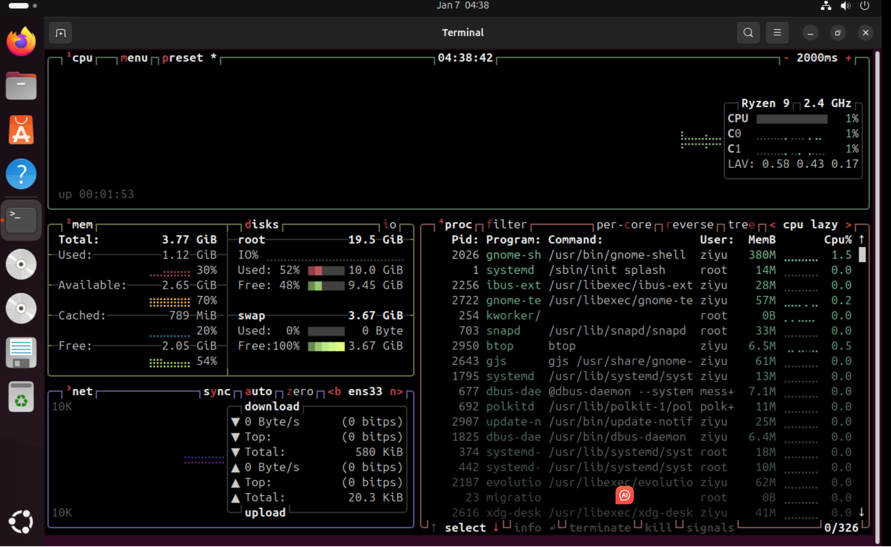

screenfetch

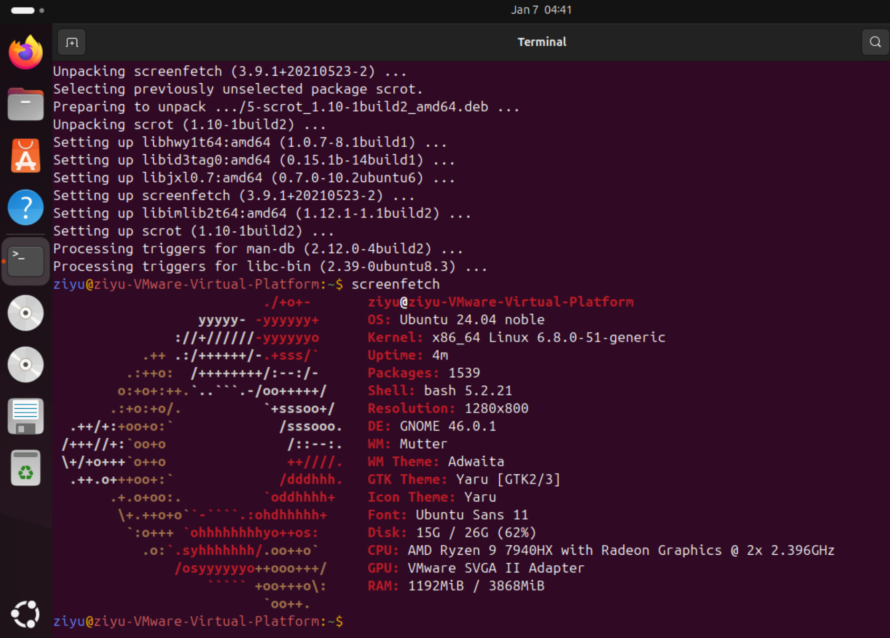

几个有趣的指令

cmatrix

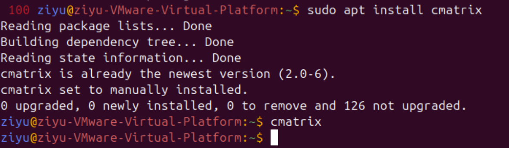

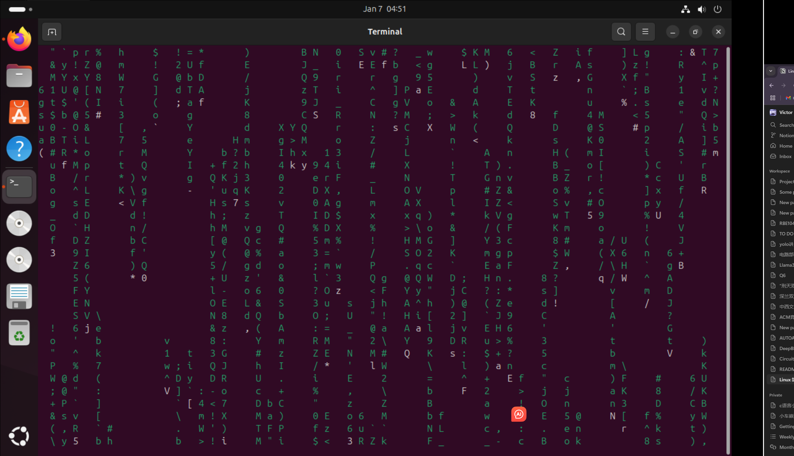

hollywood

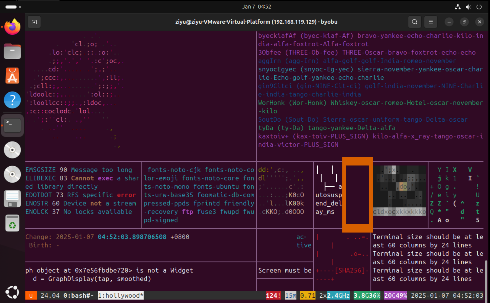

cowsay

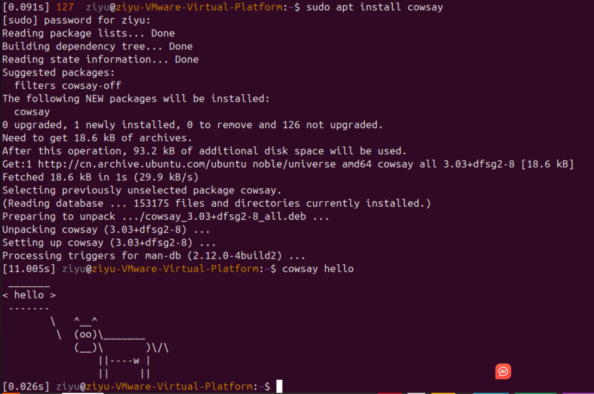

[https://zhuanlan.zhihu.com/p/51904179](https://zhuanlan.zhihu.com/p/51904179)